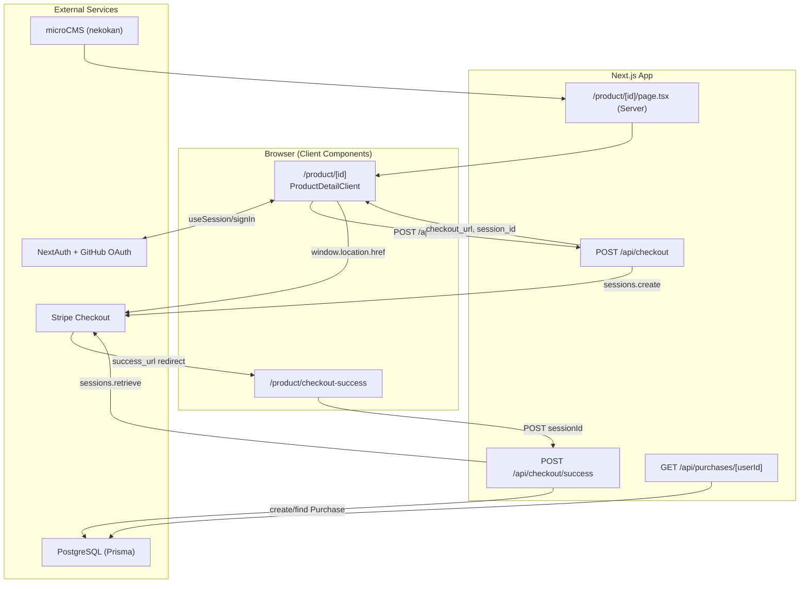

# Purchase Flow (Nekokan)

このドキュメントは、購入フローのデータの流れをこのリポジトリ実装に沿って整理したものです。

## 全体フロー

## ハッピーパス (ログイン済みで購入成功)

1. ユーザーが商品詳細 (`/product/[id]`) を開く  
   - Server Component (`app/product/[id]/page.tsx`) が `getDetailProduct(id)` で microCMS から商品を取得。
   - 取得した `product` を `ProductDetailClient` に props で渡す。
2. `ProductDetailClient` で「購入する」を確定  
   - `useSession()` でログイン済みを確認。
   - `POST /api/checkout` に `productId`, `title`, `price`, `userId` を送信。
3. `app/api/checkout/route.ts` が Stripe セッション作成  
   - `stripe.checkout.sessions.create()` 実行。
   - `metadata.productId` と `client_reference_id(userId)` を埋める。
   - `checkout_url` と `session_id` を返す。
4. クライアントが Stripe に遷移  
   - `sessionStorage` に `session_id` を保存。
   - `window.location.href = checkout_url`。
5. Stripe 成功後に `checkout-success` へ戻る  
   - `session_id` は query または `sessionStorage` から取得。
   - `POST /api/checkout/success` に `sessionId` を送信。
6. `app/api/checkout/success/route.ts` で購入履歴を保存  
   - `stripe.checkout.sessions.retrieve(sessionId)` で `paid` を確認。
   - `client_reference_id -> userId`, `metadata.productId -> bookId` を抽出。
   - `prisma.purchase` に重複チェック後 `create`。

## 主要データ対応表

| Flow key | Source | Destination |
| --- | --- | --- |
| `product.id` | microCMS (`ProductType`) | Stripe `metadata.productId` -> Prisma `Purchase.bookId` |
| `session.user.id` | NextAuth session callback | Stripe `client_reference_id` -> Prisma `Purchase.userId` |
| `price` | `ProductDetailClient` (`product.price + 500`) | Stripe `line_items.price_data.unit_amount` |
| `session_id` | Stripe checkout session | query `session_id` or `sessionStorage` fallback |

## 未ログイン時フロー

- `ProductDetailClient` の `handlePurchaseConfirm()` で `user` がなければ `signIn(undefined, { callbackUrl: /product/[id] })`。
- 認証後、同じ商品詳細ページに戻って再度購入操作。

## 監視ポイント (障害時の切り分け)

- `POST /api/checkout` のレスポンス不正 (`checkout_url` がない)。
- `POST /api/checkout/success` で `payment_status !== "paid"`。
- Prisma への保存失敗 (`purchase.create`)。
- `NEXT_PUBLIC_BASE_URL` / `STRIPE_SECRET_KEY` の環境変数不足。

